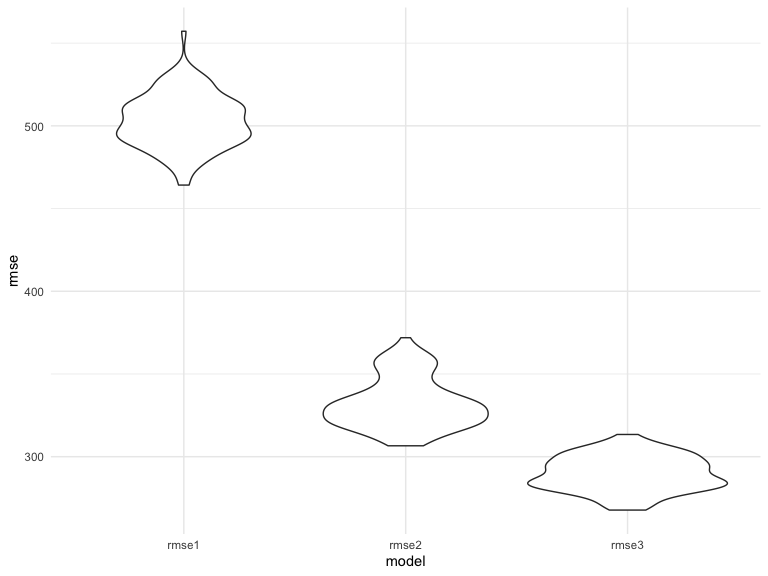

p8105\_hw6\_wl2829
================
Wentong
12/3/2021

## Problem 1

Import and tidy data

``` r
birthweight_df =
  read_csv("./data/birthweight.csv") %>% 
  mutate(
    babysex = factor(recode(babysex, `1` = "male", `2` = "female")),
    frace = factor(recode(frace, `1` = "White", `2` = "Black", `3` = "Asian",
                          `4` = "Puerto Rican", `8` = "Other", `9` = "Unknown")),
    mrace = factor(recode(mrace, `1` = "White", `2` = "Black", `3` = "Asian",
                          `4` = "Puerto Rican", `8` = "Other"))
  ) ## recode the data
```

    ## Rows: 4342 Columns: 20

    ## ── Column specification ────────────────────────────────────────────────────────
    ## Delimiter: ","
    ## dbl (20): babysex, bhead, blength, bwt, delwt, fincome, frace, gaweeks, malf...

    ## 
    ## ℹ Use `spec()` to retrieve the full column specification for this data.
    ## ℹ Specify the column types or set `show_col_types = FALSE` to quiet this message.

Propose a regression model for birthweight.

``` r
lm_mod1 = lm(bwt ~ mheight, data = birthweight_df)
```

``` r
birthweight_df %>% 
  select(bwt, mheight) %>% 
  add_predictions(lm_mod1) %>% 
  add_residuals(lm_mod1) %>% 
  ggplot(aes(x = mheight, y = resid)) +
  geom_violin()
```


Compare models

``` r
cv_df = 
  crossv_mc(birthweight_df, 100) %>% 
  mutate(
    train = map(train, as_tibble),
    test = map(test, as_tibble)
  ) %>% 
  mutate(
    lm_mod1 = map(train, ~lm(bwt ~ mheight, data = .x)),
    lm_mod2 = map(train, ~lm(bwt ~ blength + gaweeks, data = .x)),
    lm_mod3 = map(train, ~lm(bwt ~ bhead + blength + babysex + bhead*blength + bhead*babysex + blength*babysex + bhead*blength*babysex, data = .x))) %>% 
  mutate(
   rmse1 = map2_dbl(lm_mod1, test, ~rmse(model = .x, data = .y)),
   rmse2 = map2_dbl(lm_mod2, test, ~rmse(model = .x, data = .y)),
   rmse3 = map2_dbl(lm_mod3, test, ~rmse(model = .x, data = .y)))
```

Visualization of the models

``` r
cv_df %>% 
  select(starts_with("rmse")) %>% 
  pivot_longer(
    everything(),
    names_to = "model", 
    values_to = "rmse",
    names_prefix = "rmse_"
  ) %>% 
  ggplot(aes(x = model, y = rmse)) +
  geom_violin()
```



The smaller the value of rmse, the better the model, so from the plot,
we can conclude that `lm_mod3` is the best model.

## Problem 2

Import data.

``` r
weather_df = 
  rnoaa::meteo_pull_monitors(
    c("USW00094728"),
    var = c("PRCP", "TMIN", "TMAX"), 
    date_min = "2017-01-01",
    date_max = "2017-12-31") %>%
  mutate(
    name = recode(id, USW00094728 = "CentralPark_NY"),
    tmin = tmin / 10,
    tmax = tmax / 10) %>%
  select(name, id, everything())
```

    ## Registered S3 method overwritten by 'hoardr':
    ##   method           from
    ##   print.cache_info httr

    ## using cached file: ~/Library/Caches/R/noaa_ghcnd/USW00094728.dly

    ## date created (size, mb): 2021-10-09 22:52:18 (7.604)

    ## file min/max dates: 1869-01-01 / 2021-10-31

Build `boot_sample` function.

``` r
boot_sample = function(df) {
  
  sample_frac(df, replace = TRUE)
  
}
```

Bootstrapping. Create a list column

``` r
boot_straps = 
  tibble(
    strap_number = 1:5000,
    strap_sample = rerun(5000, boot_sample(weather_df))
  )
```

### r squared estimate

``` r
bootstrap_results1 = 
  boot_straps %>% 
  mutate(
    models = map(strap_sample, ~lm(tmax ~ tmin, data = .x)),
    results = map(models, broom::glance)) %>% 
  select(strap_number, results) %>% 
  unnest(results)

bootstrap_results1 %>% ## make a plot
  ggplot(aes(x = r.squared)) +
  geom_density()
```


The shape of the distribution of estimates can be used to evaluate the
performance of the estimator. The bootstrap distribution is centered at
approximately 0.91 and the shape has a heavy tail extending to low
values.

Confidence Interval

``` r
CI = c(quantile(bootstrap_results1$r.squared, 0.025), quantile(bootstrap_results1$r.squared, 0.975))
```

The 95% confidence interval is (0.894612, 0.9279277).

### Beta estimate

``` r
bootstrap_results2 = 
  boot_straps %>% 
  mutate(
    models = map(strap_sample, ~lm(tmax ~ tmin, data = .x) ),
    results = map(models, broom::tidy)) %>% 
  select(strap_number, results) %>% 
  unnest(results) %>% 
  select(strap_number, term, estimate) %>% 
  pivot_wider(names_from = term,
              values_from = estimate) %>% 
  mutate(log_beta = log(`(Intercept)` * tmin))

bootstrap_results2 %>% 
  ggplot(aes(x = log_beta)) + 
  geom_density()
```


The distribution is centered at approximately 2.02 and the shape of
distribution look similar to normal distribution.

Confidence Interval

``` r
CI = c(quantile(bootstrap_results2$log_beta, 0.025), quantile(bootstrap_results2$log_beta, 0.975))
```

The 95% confidence interval is (1.9668185, 2.0591164).
